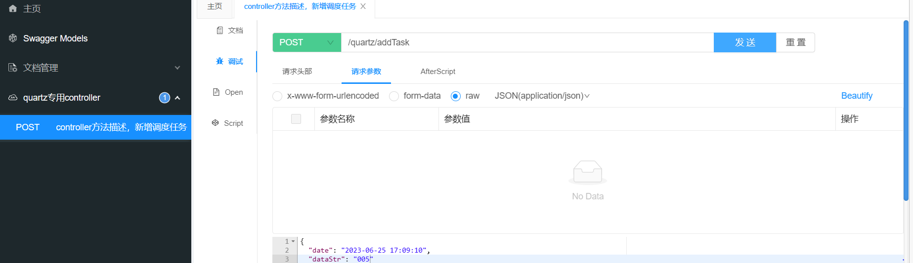
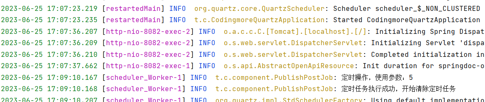

  本模块侧重：spring中quartz的整合使用（单独整合，不依赖codingmore-learning项目）
  使用最新的spring3.x + jdk17，参照spring官网说明做了一些修改
  * 整合步骤：
    * 添加依赖：
      * 主要依赖:spring-boot-starter-quartz
      * 其他依赖：根据需要添加，为了方便本地调试，加入了一些工具类
    * 添加yml配置：主要是上面依赖的一些配置，数据库使用了mysql+Druid连接池
    * 本地数据库中加入quartz常用表
  * 自测步骤：
    * 启动CodingmoreQuartzApplication
    * 访问；http://localhost:8082/doc.html
    * 按照截图传参（可根据需要修改逻辑）
  * 启动截图：
      * 
      * 
